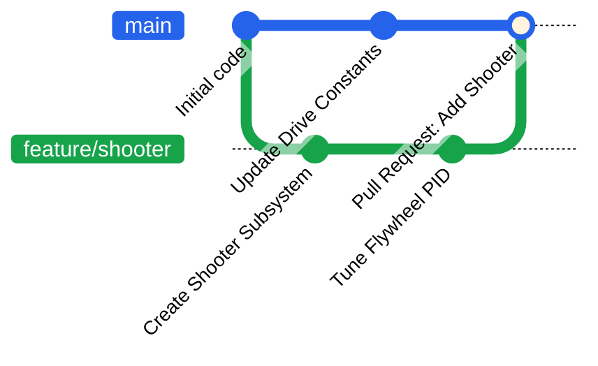

# Git Fundamentals & Workflow

Git is a time machine for your code. It allows multiple programmers to work on the robot at the same time without overwriting each other's work. 

However, if used incorrectly, it can cause a **"Gitastrophe"** (like deleting the entire autonomous routine the night before a competition). This page covers the golden rules and the daily workflow of an FRC software team.

!!! tip "Git vs. GitHub"
    **Git** is the program on your computer that tracks changes. 
    **GitHub** is the website where most people store Git repositories to allow others to access them.

---

## The Golden Rules of FRC Git

1. **Never commit directly to `main`.** The `main` branch should only contain working, tested robot code. All new code goes on a *branch*.
2. **Always pull before you start.** When you sit down at the shop, someone else might have pushed code. Pull their changes first so you don't get out of sync.
3. **Write descriptive commit messages.** Do not name every commit `"Fix stuff"`. Use names like `"Update intake motor CAN ID"`.

---

## How Git Works

Unlike a cloud folder (like Google Drive or OneDrive) that saves every keystroke instantly, Git requires you to be intentional. It works by moving your code through three "zones" on your computer:

1.  **The Workspace:** This is where you are currently typing in VSCode. These changes are "untracked."
2.  **The Staging Area:** Think of this as a **shopping cart**. You pick which files you want to include in your next save. (Command: `git add`)
3.  **The Local Repository:** Once you "Checkout" your cart, Git takes a permanent **Snapshot** of your code and stores it in a hidden folder on your laptop. (Command: `git commit`)
4.  **The Cloud Repository:** Once you have the local repository updated with the newest **Snapshot**, you can "Push" your changes to the cloud so other team members can see and use it. (Command: `git push`)

---

## The Daily Workflow

Here is exactly what you should do when you get to the shop to program a new feature (like a new shooter subsystem).



=== "1. Start Your Shift"

    When you open your laptop, make sure you are on the `main` branch and get the latest code from the cloud.
    
    ```bash
    git switch main
    git pull
    ```

=== "2. Pick Your Branch"

    **Check your current branch:** Look at the bottom-left corner of your editor or run `git status` in the terminal to see which branch you are currently on.
    
    *   **Scenario A: Continuing work from a previous session?**
        Switch to your existing feature branch:
        ```bash
        git switch feature/shooter
        ```
    *   **Scenario B: Starting a brand new feature?**
        Create a new branch (the `-c` stands for **create**):
        ```bash
        git switch -c feature/intake
        ```

    !!! danger "Don't get lost"
        If `git status` says you are on `main`, **stop**. Do not write code until you have switched to a feature branch using one of the commands above.

=== "3. Save Your Work"

    Once you've written some code, "stage" the files you changed, then "commit" them with a message.
    
    ```bash
    git add src/main/java/frc/robot/subsystems/Shooter.java
    git commit -m "Add flywheel motor controller"
    ```

=== "4. Send it to GitHub"

    Push your branch up to the cloud so the rest of the team can see it.
    
    ```bash
    git push -u origin feature/shooter
    ```

---

## Realworld Cases

Let's test your knowledge. Click on the scenarios below to play the **Gitastrophe Simulator**.

??? question "Scenario 1: The Accidental Main"

    **The Situation:** You just spent two hours writing the most beautiful auto-aim code the world has ever seen. You go to commit, but you look at the bottom left of VSCode and realize... you are on the `main` branch. 
    
    What do you do?

    *   **Choice A: Just commit and `git push -f` (Force Push).**
        <div style="padding-left: 20px;">
        ❌ <b>WRONG.</b> You just overwrote the remote `main` branch and deleted the drive team's joystick configurations from yesterday. Your lead programmer is crying.
        </div>

    *   **Choice B: Run `git switch -c feature/auto-aim`.**
        <div style="padding-left: 20px;">
        ✅ <b>CORRECT!</b> Git is smart. If you haven't committed yet, creating a new branch with `switch -c` will carry your uncommitted changes over to the new branch safely!
        </div>

??? question "Scenario 2: The Merge Conflict"

    **The Situation:** You are trying to merge your branch into `main`, but GitHub says there is a **Merge Conflict** in `Constants.java`. Your teammate added Drive constants, and you added Intake constants on the exact same lines.

    What do you do?

    *   **Choice A: Accept your changes and delete your teammate's code.**
        <div style="padding-left: 20px;">
        ❌ <b>WRONG.</b> The robot no longer knows how to drive. The drive base violently slams into the alliance station wall.
        </div>

    *   **Choice B: Open VSCode's Merge Editor.**
        <div style="padding-left: 20px;">
        ✅ <b>CORRECT!</b> Look for the markers (<code><<<<<<< HEAD</code>). VSCode will let you click "Accept Both Changes", combining the Drive constants and the Intake constants perfectly.
        </div>

??? question "Scenario 3: The Broken Build"

    **The Situation:** You pull `main`, try to build the robot code, and you get a massive red error in the terminal: `Build failed with an exception.`

    What do you do?

    *   **Choice A: Re-write the code to fix the error yourself.**
        <div style="padding-left: 20px;">
        ❌ <b>WRONG.</b> You don't know what they were trying to do. You might fix the build but break the logic. 
        </div>

    *   **Choice B: Yell across the shop, "WHO BROKE THE BUILD!?"**
        <div style="padding-left: 20px;">
        ✅ <b>CORRECT! (Mostly).</b> Run <code>git log</code> to see who the last person to commit to <code>main</code> was, and politely ask them to fix their code. The golden rule is: <i>If you break main, you fix main.</i>
        </div>

---

## Commit Small, Commit Often

Don't wait until the entire subsystem is finished to save your work. In FRC, the robot (or your laptop battery) could break at any moment.

!!! tip "The Atomic Commit Rule"
    Try to make your commits small enough that they only do **one** thing. This makes it easy to undo a mistake without losing the work that actually worked.

    *   **The Bad Way (Monolithic Commit):**
        - `"Added shooter, fixed drivetrain, changed auton, and updated constants"` 
        - *Pitfall:* If the shooter code breaks the robot, you have to undo the drivetrain and auton fixes too.

    *   **The Good Way (Atomic Commits):**
        1. `"Add shooter motor ports to ShooterConstants.java"`
        2. `"Create Shooter subsystem base class"`
        3. `"Add PID tuning for shooter flywheel"`

---

## Further Practice

If you want to practice Git without risking your actual robot code, check out [**Oh My Git!**](https://ohmygit.org/). 

*(Shoutout to Drake from 10619 for the recommendation!)* It is an open-source game that turns your terminal into a visual playground, allowing you to learn branches, merges, and rebases interactively.
